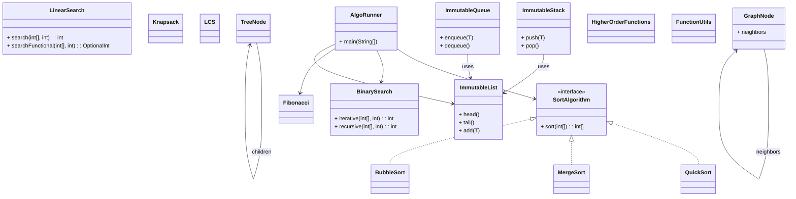

# AlgoBox – Algorithms & Data Structures Explorer (Java 25 + FP)

AlgoBox is mostly a learning / demonstration project, not a production system.
The main goal is showing:

- Functional programming & higher-order functions
- Immutable data structures (lists, stacks, queues)
- Sorting & searching algorithms (imperative + pure FP)
- Graph algorithms (DFS, BFS, Dijkstra)
- Dynamic programming examples (Fibonacci, Knapsack, LCS)
- Clean architecture with CLI interface
- Full unit tests with JUnit 5
- Benchmark-ready design (JMH)
- Optional REST API support (Spring Boot) -> to de developed

This project serves mainly as a **learning tool** but also as a **portfolio-quality demonstration** of software engineering skills.

---

## Features

### Sorting
- QuickSort, MergeSort, BubbleSort (imperative + pure functional)

### Searching
- LinearSearch, BinarySearch (recursive + iterative)

### Immutable Data Structures
- ImmutableList, ImmutableStack, ImmutableQueue
- TreeNode, GraphNode

### Graph Algorithms
- Depth-First Search (DFS)
- Breadth-First Search (BFS)
- Dijkstra’s Algorithm (weighted shortest path)
- Distance matrix calculation

### Dynamic Programming
- Fibonacci (recursive + memoized)
- Knapsack problem
- Longest Common Subsequence (LCS)

### Functional Programming Utilities
- Higher-order functions
- Function composition, currying, predicates

### CLI / Runner
- `AlgoRunner` allows running algorithms from the command line

### Testing & Benchmarking
- Full JUnit 5 coverage
- Optional JMH benchmarking setup

---

## 🛠 Technologies Used
- Java 25
- Maven
- JUnit 5
- GitHub Actions CI (TODO)
- Optional: Spring Boot REST API (TODO)

---

## 📦 Build & Run

Build project:
```bash
mvn clean package
```

Run CLI interface:
```bash
java -jar target/algobox-cli.jar
```

Run tests:
```bash
mvn test
```

## Algorithm Complexity Reference

| Algorithm      | Best Case | Average Case | Worst Case |
| -------------- | -------- | ------- | --------- |
| QuickSort      | O(nlogn) | O(nlogn) | O(n²)     |
| MergeSort      | O(nlogn) | O(nlogn) | O(nlogn)  |
| BubbleSort     | O(n)     | O(n²)   | O(n²)     |
| LinearSearch   | O(1)     | O(n/2)  | O(n)      |
| BinarySearch   | O(1)     | O(logn) | O(logn)   |
| DFS/BFS        | O(V+E)   | O(V+E)  | O(V+E)    |
| Dijkstra       | O(E+VlogV) | O(E+VlogV) | O(E+VlogV) |
| Fibonacci (DP) | O(n)     | O(n)    | O(n)      |
| Knapsack (DP)  | O(n*W)   | O(n*W)  | O(n*W)    |
| LCS (DP)       | O(m*n)   | O(m*n)  | O(m*n)    |


## 📚 Roadmap / Extensions (ALL IN TODO)
- Add more graph algorithms: A*, Bellman-Ford
- Add more DP problems: Matrix Chain Multiplication
- Add REST API endpoints
- Dockerize the project 
- Add JMH benchmarking suite for all algorithms


## WAy to run JMH
```bash
mvn clean install
java -jar target/benchmarks.jar
```




---
## Algorithms / Sorting / BubbleSort

### BubbleSortIterative (Imperative)
A classic, optimized, idiomatic Java implementation.
- Uses loops and in-place swaps (on a cloned array).
- Includes early-exit optimization.
- Minimal overhead, predictable performance.
- Suitable as a practical, production-style implementation
### PureBubbleSort (Functional-Style)
A purely functional interpretation of Bubble Sort.
- No mutation of any data structure.
- Each pass returns a new immutable list.
- Recursion replaces the outer loop
- Useful for demonstrating functional concepts and algorithmic transformation
#### Key Differences
| Aspect               | 	Imperative                       | 	Functional-Style                      |
|----------------------|-----------------------------------|----------------------------------------|
| **Paradigm**         | Imperative loops + local mutation | 	Immutable + recursive                 |
| **Input mutation**   | Never	                            | Never                                  |
| **Data structures**	 | Mutable array (clone)	            | Immutable lists                        |
| **Performance**      | Fastest, minimal overhead	        | Significantly slower, more allocations |
| **Use case**         | Practical/production	             | Conceptual/educational                 |

---
## Algorithms / Sorting / QuickSort

This project includes two complementary implementations of **QuickSort**, each showcasing a different algorithmic paradigm.  
Both follow the shared `SortAlgorithm` interface and always return a new sorted array without mutating the input.

---

### QuickSortIterative (Imperative, Efficient)
A production-quality QuickSort implemented with in-place partitioning on a defensive copy of the input.

- Classic divide-et-impera approach
- Uses Lomuto partition scheme
- Tail recursion optimization for stack efficiency
- Fastest and most memory-efficient version

**Best for:** performance in real-world usage.

---

### PureQuickSort (Functional-Style, Immutable)
A purely functional interpretation of QuickSort using recursion and immutable arrays.

- No mutation of any data structures
- Splits into `less`, `equal`, `greater` partitions
- Highlights functional clarity and algorithmic expressiveness

**Best for:** demonstrating functional thinking and paradigm versatility.

---

### **Key Differences**

| Aspect | Imperative QuickSort | Functional QuickSort |
|--------|-----------------------|-----------------------|
| Paradigm | Imperative | Functional-style |
| Mutability | Local mutation on cloned array | Fully immutable |
| Performance | Very fast (O(n log n)) | Slower (more allocations) |
| Memory usage | Low | Higher due to array copies |
| Use case | Practical/production | Conceptual/educational |

---
## Algorithms / Sorting / MergeSort

This project includes two complementary versions of **MergeSort**, each following the shared `SortAlgorithm` interface and returning a new sorted array without mutating the input.

---

### MergeSortImperative (Efficient, Practical)
A classic top-down MergeSort implementation using an auxiliary buffer.

- Recursively divides the array into halves
- Reuses a temporary buffer for efficient merging
- Stable, deterministic, and runs in O(n log n)
- Ideal for production-style usage

**Best for:** efficiency, clarity, and real-world applicability.

---

### PureMergeSort (Functional-Style, Immutable)
A purely functional variant of MergeSort.

- No mutation of any data structures
- Recursively splits arrays and merges them immutably
- Highlights clean functional decomposition

**Best for:** demonstrating functional programming and recursive purity.

---

### **Key Differences**

| Aspect | Imperative MergeSort | Functional MergeSort |
|--------|------------------------|-----------------------|
| Paradigm | Imperative | Functional-style |
| Mutability | Local mutation (aux buffer only) | Fully immutable |
| Performance | Faster, memory-efficient | More allocation-heavy |
| Stability | Stable | Stable |
| Use case | Practical/production | Educational/conceptual |

---
## Algorithms / Searching / BinarySearch

This project includes two complementary versions of **Binary Search**, both assuming the input array is already sorted.

---

### BinarySearchIterative (Imperative, Efficient)
A loop-based implementation of Binary Search.

- Constant space usage
- O(log n) time complexity
- Fastest and most practical form
- Clear and predictable control flow

**Best for:** real-world usage and performance.

---

### PureBinarySearch (Functional-Style, Recursive)
A clean recursive version that expresses Binary Search functionally.

- No mutation
- Pure recursive decomposition
- O(log n) time, O(log n) stack

**Best for:** demonstrating functional thinking and recursion.

---

### **Key Differences**

| Aspect | Iterative Binary Search | Functional Binary Search |
|--------|--------------------------|---------------------------|
| Paradigm | Imperative | Functional-style |
| Mutability | None | None |
| Stack usage | O(1) | O(log n) |
| Readability | Explicit loop logic | Declarative recursion |
| Use case | Practical/production | Educational/conceptual |

---

## Algorithms / Searching / LinearSearch

This project includes two complementary versions of **Linear Search**, both returning the index of the target or -1 if not found.

---

### LinearSearchIterative (Imperative)
A classic loop-based implementation.

- Scans sequentially
- O(n) time complexity, O(1) space
- Fastest for unsorted arrays and practical usage

**Best for:** real-world scenarios and performance.

---

### PureLinearSearch (Functional-Style, Stream)
A declarative functional variant using Java Streams.

- No mutation
- Expressive, functional style
- O(n) time complexity

**Best for:** showcasing functional programming and clean code.

---

### **Key Differences**

| Aspect | Iterative Linear Search | Functional Linear Search |
|--------|-------------------------|-------------------------|
| Paradigm | Imperative | Functional-style |
| Mutability | None | None |
| Readability | Explicit loop | Declarative stream |
| Performance | Slightly faster | Slightly slower due to stream overhead |
| Use case | Practical/production | Educational/conceptual |

---

## Algorithms / Graphs

This repository includes classic graph algorithms implemented on immutable `GraphNode`s.

---

### **DFS (Depth-First Search)**

1. **Recursive DFS** (`dfsRecursive`)
    - Explores as far as possible along each branch before backtracking
    - Uses recursion and a `Set` to track visited nodes

2. **Iterative DFS** (`dfsIterative`)
    - Uses an explicit stack instead of recursion
    - Demonstrates alternative iterative implementation

**Key differences:** recursion vs explicit stack; behavior identical.

---

### **BFS (Breadth-First Search)**

- Level-order traversal using a queue
- Guarantees visiting nodes in shortest-path order for unweighted graphs
- Iterative by nature

---

### **Dijkstra's Algorithm**

- Computes shortest paths from a start node (currently unweighted edges, weight = 1)
- Uses a priority queue for efficiency
- Returns a map of nodes to distances
- Can be extended for weighted graphs

---

### **Benchmark Notes**

| Algorithm | Input            | Complexity       | Notes                    |
|-----------|------------------|------------------|--------------------------|
| DFS       | n nodes, m edges | O(n + m)         | Recursive or iterative   |
| BFS       | n nodes, m edges | O(n + m)         | Iterative                |
| Dijkstra  | n nodes, m edges | O((n + m) log n) | Assumes unweighted edges |

---

## Algorithms / Dynamic Programming

This repository includes classic dynamic programming problems with multiple approaches to highlight different paradigms.

---

### **Fibonacci Sequence**

1. **Naive recursive**: exponential time, educational.
2. **Memoized recursive**: top-down DP, O(n) time, O(n) space.
3. **Iterative DP**: bottom-up approach, O(n) time, O(n) space.

**Key differences:**
- Naive recursion is simple but slow.
- Memoized recursion introduces caching for efficiency.
- Iterative DP avoids recursion overhead.

---

### **0/1 Knapsack**

- Iterative DP solution
- Solves the maximum value achievable for a given capacity
- Time complexity: O(n*W), space complexity: O(n*W)

---

### **Longest Common Subsequence (LCS)**

- Iterative DP solution
- Computes the length of the LCS between two strings
- Time complexity: O(m*n), space complexity: O(m*n)
